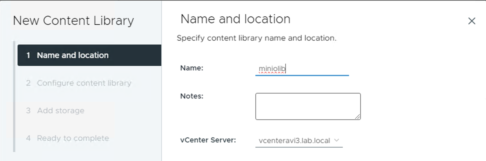
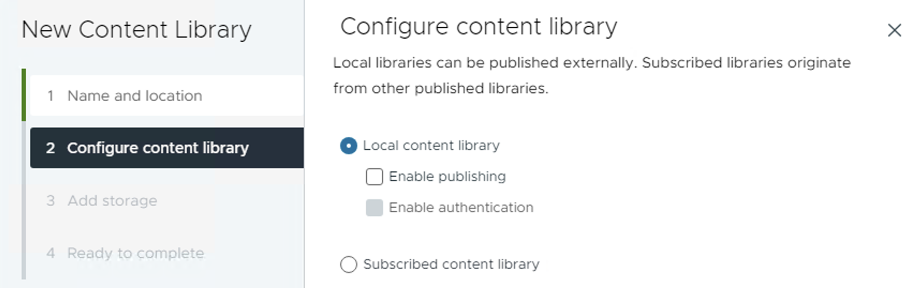
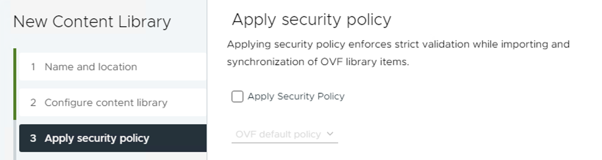
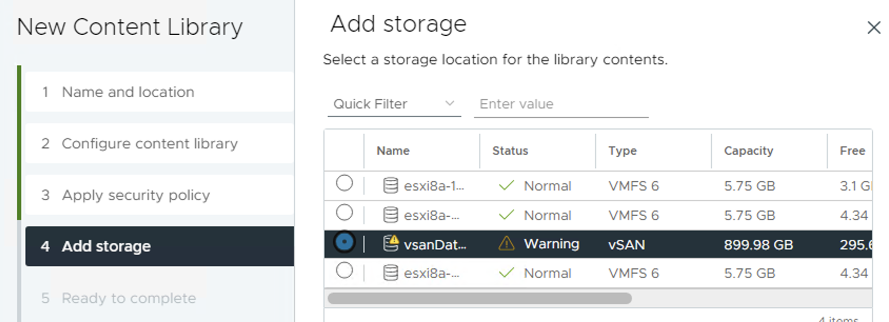
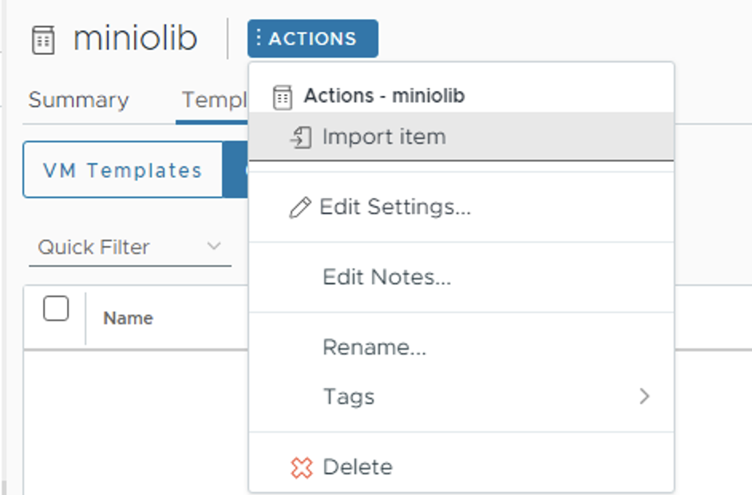
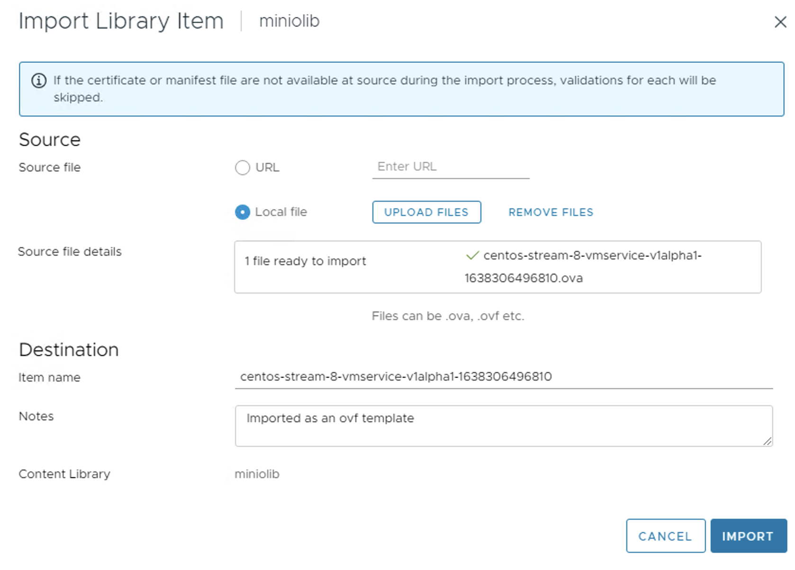
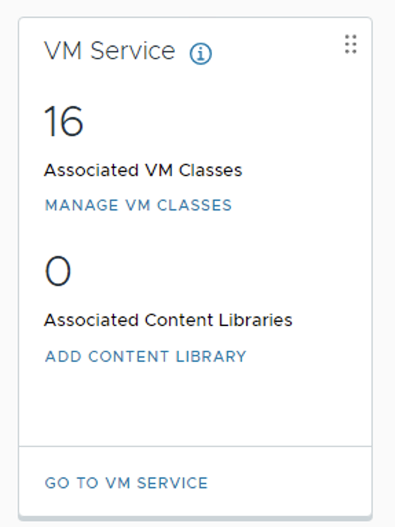
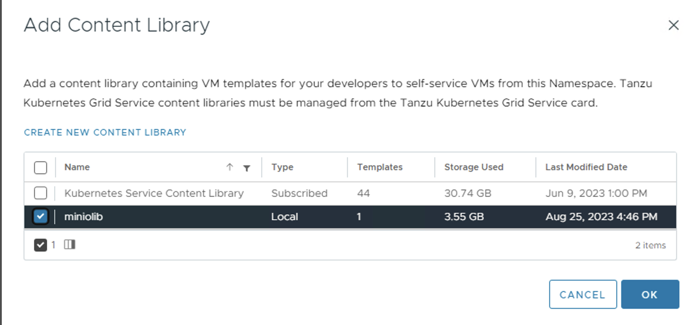
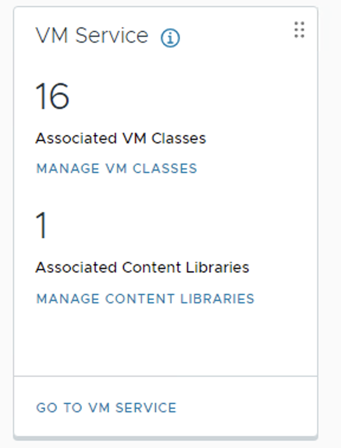

# MinIO on VM Service


Link to the special VMService VM on Marketplace (download) 

```
https://marketplace.cloud.vmware.com/services/details/vm-service-image-for-centos1111?slug=true
```

Create a new content library for the image









Import image into content lib





Add the minio content lib to the vsphere namespace (my canse namespace1000)








Check on the image

```
k config use-context namespace1000

Switched to context "namespace1000".
[root@localhost minio]# k get nodes
NAME                               STATUS   ROLES                  AGE   VERSION
4223110e3b11a02b6b177db0551f41ec   Ready    control-plane,master   77d   v1.24.9+vmware.wcp.1
42234f3fd4ee6ad71dde6b4da15622e5   Ready    control-plane,master   77d   v1.24.9+vmware.wcp.1
422398077f99efb5bf4475df395f65f3   Ready    control-plane,master   77d   v1.24.9+vmware.wcp.1
[root@localhost minio]#

kubectl get virtualmachineclassbindings

NAME                  AGE
best-effort-2xlarge   76d
best-effort-4xlarge   76d
best-effort-8xlarge   76d
best-effort-large     76d
best-effort-medium    76d
best-effort-small     76d
best-effort-xlarge    76d
best-effort-xsmall    76d
guaranteed-2xlarge    76d
guaranteed-4xlarge    76d
guaranteed-8xlarge    76d
guaranteed-large      76d
guaranteed-medium     76d
guaranteed-small      76d
guaranteed-xlarge     76d
guaranteed-xsmall     76d

kubectl get virtualmachineimages

NAME                                                                        PROVIDER-NAME                          CONTENT-LIBRARY-NAME   IMAGE-NAME                                                                  VERSION                                 OS-TYPE               FORMAT   AGE
centos-stream-8-vmservice-v1alpha1-1638306496810                            49cd0e81-beee-487c-925d-ded803265fa3                          centos-stream-8-vmservice-v1alpha1-1638306496810                                                                    centos8_64Guest       ovf      41m
ob-15957779-photon-3-k8s-v1.16.8---vmware.1-tkg.3.60d2ffd                   4d3b8db5-bf50-453f-b7d9-adc11e03fc79                          ob-15957779-photon-3-k8s-v1.16.8---vmware.1-tkg.3.60d2ffd                   v1.16.8+vmware.1-tkg.3.60d2ffd          vmwarePhoton64Guest   ovf      77d
.
.
.
ob-22187091-ubuntu-2004-amd64-vmi-k8s-v1.26.5---vmware.2-fips.1-tkg.1       4d3b8db5-bf50-453f-b7d9-adc11e03fc79                          ob-22187091-ubuntu-2004-amd64-vmi-k8s-v1.26.5---vmware.2-fips.1-tkg.1       v1.26.5+vmware.2-fips.1                 ubuntu64Guest         ovf      37h


kubectl get resourcequotas

NAME                         AGE   REQUEST                                                                                               LIMIT
namespace1000-storagequota   76d   pacific-gold-storage-policy.storageclass.storage.k8s.io/requests.storage: 203Gi/9223372036854775807   

k get sc

NAME                          PROVISIONER              RECLAIMPOLICY   VOLUMEBINDINGMODE   ALLOWVOLUMEEXPANSION   AGE
pacific-gold-storage-policy   csi.vsphere.vmware.com   Delete          Immediate           true                   76d

kubectl get network

NAME    AGE
work1   76d

```

Generate a key for the VM on your jump server

```
ssh-keygen -t rsa -b 4096

Generating public/private rsa key pair.
Enter file in which to save the key (/root/.ssh/id_rsa): 
Enter passphrase (empty for no passphrase): 
Enter same passphrase again: 
Your identification has been saved in /root/.ssh/id_rsa
Your public key has been saved in /root/.ssh/id_rsa.pub
The key fingerprint is:
SHA256:PYyUkw5SWf/3Q0uR3vNV3o/Q1KGTUesH5nRHmZdnhy0 root@localhost.localdomain
The key's randomart image is:
+---[RSA 4096]----+
|      .o.    ..==|
|     ..  +    E*X|
|    . . = .  +=*O|
|     . + = . *++*|
|        S + o +**|
|           . oooB|
|              .o+|
|                .|
|                 |
+----[SHA256]-----+
```

Extract the pub key

```
cat /root/.ssh/id_rsa.pub

ssh-rsa AAAAB3NzaC1yc2EAAAADAQABAAACAQCjuBKpQqHYYtpRCyPx9eJ4VgvFKwq4ysaUW0hEfkH9qhEltCcR7db8n5ikHQkQesTYftV1FkbhnoZXA2SDTLzUF/M24ZyzBVOPP+goJa5UBiw4/6MPwVcK+epmCyUDRDqW0dw4EM13xmb+I1Rq0RMh86MaD3I99iY848F60QjLEVokonvbI3dR9ecpuydXzP9Pt4Scn8YTHJ5ywnZ0jCbMh9HJxJXyLDUDWG5dPYV9I+7v+GB90VaOcLMqmILWrUk+v2pmpFDfOCLfnKR9HHHUu2S+gw2wFiePo4WgoHMDKm7sRllheLhWRVAdPhZE8hsRm7sZK072kV0sEXsKdKB20wHDgCmYuOxiY2dP4GYrP/Um0jN3IbIJDRP1VN2ruZc7vY6TRPTfEBdineVRQ8WQIOLb3RwK85xFM2Au5k33inOA6wOWWm9RNGJwo5QfJLgHTXhRO+uPegfGFyAYWskrH9I93DgPSypP9/RBV3CesZuO1rsLRgzwBoOypG+ZSsRVLDxJV9bg1VYl61nfzxUTuQQVkerhAmepwz7sovHqpVQ5thIYrbKkMV/gJBDouVa6qG/jtItBCxAa6Tlok2lE5MViPxdIICdLTuzmwhvjlZtnP7Q+u/KtuC6w45aWBT8iuW+wakzz6wNfwSNUG3a9vrVWTBwQRR8ljQuKVVQnxw== root@localhost.localdomain
```

Create the cloud-init.yaml file and add above ssh key

```

#cloud-config
chpasswd:
    list: |
      centos:VMware1!
    expire: false
ssh_pwauth: True
groups:
  - docker
users:
  - default
  - name: centos
    ssh-authorized-keys:
      - ssh-rsa AAAAB3NzaC1yc2EAAAADAQABAAACAQCjuBKpQqHYYtpRCyPx9eJ4VgvFKwq4ysaUW0hEfkH9qhEltCcR7db8n5ikHQkQesTYftV1FkbhnoZXA2SDTLzUF/M24ZyzBVOPP+goJa5UBiw4/6MPwVcK+epmCyUDRDqW0dw4EM13xmb+I1Rq0RMh86MaD3I99iY848F60QjLEVokonvbI3dR9ecpuydXzP9Pt4Scn8YTHJ5ywnZ0jCbMh9HJxJXyLDUDWG5dPYV9I+7v+GB90VaOcLMqmILWrUk+v2pmpFDfOCLfnKR9HHHUu2S+gw2wFiePo4WgoHMDKm7sRllheLhWRVAdPhZE8hsRm7sZK072kV0sEXsKdKB20wHDgCmYuOxiY2dP4GYrP/Um0jN3IbIJDRP1VN2ruZc7vY6TRPTfEBdineVRQ8WQIOLb3RwK85xFM2Au5k33inOA6wOWWm9RNGJwo5QfJLgHTXhRO+uPegfGFyAYWskrH9I93DgPSypP9/RBV3CesZuO1rsLRgzwBoOypG+ZSsRVLDxJV9bg1VYl61nfzxUTuQQVkerhAmepwz7sovHqpVQ5thIYrbKkMV/gJBDouVa6qG/jtItBCxAa6Tlok2lE5MViPxdIICdLTuzmwhvjlZtnP7Q+u/KtuC6w45aWBT8iuW+wakzz6wNfwSNUG3a9vrVWTBwQRR8ljQuKVVQnxw== root@localhost.localdomain
    sudo: ALL=(ALL) NOPASSWD:ALL
    groups: sudo, docker
    shell: /bin/bash
network:
  version: 2
  ethernets:
      ens192:
          dhcp4: true
package_update: true
packages:
  - net-tools
runcmd:
  - cd /opt
  - wget https://dl.minio.io/server/minio/release/linux-amd64/minio
  - chmod +x minio
  - mkdir /mnt/data
  - /opt/minio server /mnt/data
  - firewall-offline-cmd --add-port=9000/tcp
  - firewall-cmd --reload
  - systemctl restart sshd

```

Convert to base64

```
cat cloud-init.yaml | base64 -w0

I2Nsb3VkLWNvbmZpZwpjaHBhc3N3ZDoKICAgIGxpc3Q6IHwKICAgICAgY2VudG9zOlZNd2FyZTEhCiAgICBleHBpcmU6IGZhbHNlCnNzaF9wd2F1dGg6IFRydWUKZ3JvdXBzOgogIC0gZG9ja2VyCnVzZXJzOgogIC0gZGVmYXVsdAogIC0gbmFtZTogY2VudG9zCiAgICBzc2gtYXV0aG9yaXplZC1rZXlzOgogICAgICAtIHNzaC1yc2EgQUFBQUIzTnphQzF5YzJFQUFBQURBUUFCQUFBQ0FRQ2p1QktwUXFIWVl0cFJDeVB4OWVKNFZndkZLd3E0eXNhVVcwaEVma0g5cWhFbHRDY1I3ZGI4bjVpa0hRa1Flc1RZZnRWMUZrYmhub1pYQTJTRFRMelVGL00yNFp5ekJWT1BQK2dvSmE1VUJpdzQvNk1Qd1ZjSytlcG1DeVVEUkRxVzBkdzRFTTEzeG1iK0kxUnEwUk1oODZNYUQzSTk5aVk4NDhGNjBRakxFVm9rb252YkkzZFI5ZWNwdXlkWHpQOVB0NFNjbjhZVEhKNXl3blowakNiTWg5SEp4Slh5TERVRFdHNWRQWVY5SSs3ditHQjkwVmFPY0xNcW1JTFdyVWsrdjJwbXBGRGZPQ0xmbktSOUhISFV1MlMrZ3cyd0ZpZVBvNFdnb0hNREttN3NSbGxoZUxoV1JWQWRQaFpFOGhzUm03c1pLMDcya1Ywc0VYc0tkS0IyMHdIRGdDbVl1T3hpWTJkUDRHWXJQL1VtMGpOM0liSUpEUlAxVk4ycnVaYzd2WTZUUlBUZkVCZGluZVZSUThXUUlPTGIzUndLODV4Rk0yQXU1azMzaW5PQTZ3T1dXbTlSTkdKd281UWZKTGdIVFhoUk8rdVBlZ2ZHRnlBWVdza3JIOUk5M0RnUFN5cFA5L1JCVjNDZXNadU8xcnNMUmd6d0JvT3lwRytaU3NSVkxEeEpWOWJnMVZZbDYxbmZ6eFVUdVFRVmtlcmhBbWVwd3o3c292SHFwVlE1dGhJWXJiS2tNVi9nSkJEb3VWYTZxRy9qdEl0QkN4QWE2VGxvazJsRTVNVmlQeGRJSUNkTFR1em13aHZqbFp0blA3USt1L0t0dUM2dzQ1YVdCVDhpdVcrd2Freno2d05md1NOVUczYTl2clZXVEJ3UVJSOGxqUXVLVlZRbnh3PT0gcm9vdEBsb2NhbGhvc3QubG9jYWxkb21haW4KICAgIHN1ZG86IEFMTD0oQUxMKSBOT1BBU1NXRDpBTEwKICAgIGdyb3Vwczogc3VkbywgZG9ja2VyCiAgICBzaGVsbDogL2Jpbi9iYXNoCm5ldHdvcms6CiAgdmVyc2lvbjogMgogIGV0aGVybmV0czoKICAgICAgZW5zMTkyOgogICAgICAgICAgZGhjcDQ6IHRydWUKcGFja2FnZV91cGRhdGU6IHRydWUKcGFja2FnZXM6CiAgLSBuZXQtdG9vbHMKcnVuY21kOgogIC0gY2QgL29wdAogIC0gd2dldCBodHRwczovL2RsLm1pbmlvLmlvL3NlcnZlci9taW5pby9yZWxlYXNlL2xpbnV4LWFtZDY0L21pbmlvCiAgLSBjaG1vZCAreCBtaW5pbwogIC0gbWtkaXIgL21udC9kYXRhCiAgLSAvb3B0L21pbmlvIHNlcnZlciAvbW50L2RhdGEKICAtIGZpcmV3YWxsLW9mZmxpbmUtY21kIC0tYWRkLXBvcnQ9OTAwMC90Y3AKICAtIGZpcmV3YWxsLWNtZCAtLXJlbG9hZAogIC0gc3lzdGVtY3RsIHJlc3RhcnQgc3NoZAo=

```

Create the vm.yaml file

```

# vm.yaml
---
apiVersion: v1
kind: PersistentVolumeClaim
metadata:
  name: minio-pvc
  namespace: namespace1000
spec:
  accessModes:
  - ReadWriteOnce
  resources:
    requests:
      storage: 4Gi
  storageClassName: pacific-gold-storage-policy
  volumeMode: Filesystem
---
apiVersion: vmoperator.vmware.com/v1alpha1
kind: VirtualMachine
metadata:
  labels:
    vm-selector: minio-centosvm
  name: minio-centosvm
  namespace: namespace1000
spec:
  imageName: centos-stream-8-vmservice-v1alpha1-1638306496810 #centos-stream-8-vmservice-v1alpha1-1619529007339
  className: best-effort-small
  powerState: poweredOn
  storageClass: pacific-gold-storage-policy
  networkInterfaces:
#  - networkType: nsx-t
  - networkType: vsphere-distributed
    networkName: "work1"
  volumes:
  - name: my-centos-vol
    persistentVolumeClaim:
      claimName: minio-pvc
  readinessProbe:
    tcpSocket:
      port: 22
  vmMetadata:
    configMapName: centos-cloudinit
    transport: OvfEnv
---
apiVersion: v1
kind: ConfigMap
metadata:
    name: centos-cloudinit
    namespace: namespace1000
data:
  user-data: I2Nsb3VkLWNvbmZpZwpjaHBhc3N3ZDoKICAgIGxpc3Q6IHwKICAgICAgY2VudG9zOlZNd2FyZTEhCiAgICBleHBpcmU6IGZhbHNlCnNzaF9wd2F1dGg6IFRydWUKZ3JvdXBzOgogIC0gZG9ja2VyCnVzZXJzOgogIC0gZGVmYXVsdAogIC0gbmFtZTogY2VudG9zCiAgICBzc2gtYXV0aG9yaXplZC1rZXlzOgogICAgICAtIHNzaC1yc2EgQUFBQUIzTnphQzF5YzJFQUFBQURBUUFCQUFBQ0FRQ2p1QktwUXFIWVl0cFJDeVB4OWVKNFZndkZLd3E0eXNhVVcwaEVma0g5cWhFbHRDY1I3ZGI4bjVpa0hRa1Flc1RZZnRWMUZrYmhub1pYQTJTRFRMelVGL00yNFp5ekJWT1BQK2dvSmE1VUJpdzQvNk1Qd1ZjSytlcG1DeVVEUkRxVzBkdzRFTTEzeG1iK0kxUnEwUk1oODZNYUQzSTk5aVk4NDhGNjBRakxFVm9rb252YkkzZFI5ZWNwdXlkWHpQOVB0NFNjbjhZVEhKNXl3blowakNiTWg5SEp4Slh5TERVRFdHNWRQWVY5SSs3ditHQjkwVmFPY0xNcW1JTFdyVWsrdjJwbXBGRGZPQ0xmbktSOUhISFV1MlMrZ3cyd0ZpZVBvNFdnb0hNREttN3NSbGxoZUxoV1JWQWRQaFpFOGhzUm03c1pLMDcya1Ywc0VYc0tkS0IyMHdIRGdDbVl1T3hpWTJkUDRHWXJQL1VtMGpOM0liSUpEUlAxVk4ycnVaYzd2WTZUUlBUZkVCZGluZVZSUThXUUlPTGIzUndLODV4Rk0yQXU1azMzaW5PQTZ3T1dXbTlSTkdKd281UWZKTGdIVFhoUk8rdVBlZ2ZHRnlBWVdza3JIOUk5M0RnUFN5cFA5L1JCVjNDZXNadU8xcnNMUmd6d0JvT3lwRytaU3NSVkxEeEpWOWJnMVZZbDYxbmZ6eFVUdVFRVmtlcmhBbWVwd3o3c292SHFwVlE1dGhJWXJiS2tNVi9nSkJEb3VWYTZxRy9qdEl0QkN4QWE2VGxvazJsRTVNVmlQeGRJSUNkTFR1em13aHZqbFp0blA3USt1L0t0dUM2dzQ1YVdCVDhpdVcrd2Freno2d05md1NOVUczYTl2clZXVEJ3UVJSOGxqUXVLVlZRbnh3PT0gcm9vdEBsb2NhbGhvc3QubG9jYWxkb21haW4KICAgIHN1ZG86IEFMTD0oQUxMKSBOT1BBU1NXRDpBTEwKICAgIGdyb3Vwczogc3VkbywgZG9ja2VyCiAgICBzaGVsbDogL2Jpbi9iYXNoCm5ldHdvcms6CiAgdmVyc2lvbjogMgogIGV0aGVybmV0czoKICAgICAgZW5zMTkyOgogICAgICAgICAgZGhjcDQ6IHRydWUKcGFja2FnZV91cGRhdGU6IHRydWUKcGFja2FnZXM6CiAgLSBuZXQtdG9vbHMKcnVuY21kOgogIC0gY2QgL29wdAogIC0gd2dldCBodHRwczovL2RsLm1pbmlvLmlvL3NlcnZlci9taW5pby9yZWxlYXNlL2xpbnV4LWFtZDY0L21pbmlvCiAgLSBjaG1vZCAreCBtaW5pbwogIC0gbWtkaXIgL21udC9kYXRhCiAgLSAvb3B0L21pbmlvIHNlcnZlciAvbW50L2RhdGEKICAtIGZpcmV3YWxsLW9mZmxpbmUtY21kIC0tYWRkLXBvcnQ9OTAwMC90Y3AKICAtIGZpcmV3YWxsLWNtZCAtLXJlbG9hZAogIC0gc3lzdGVtY3RsIHJlc3RhcnQgc3NoZAo=
  hostname: centos-minio
---
apiVersion: vmoperator.vmware.com/v1alpha1
kind: VirtualMachineService
metadata:
  name: minio-vmservices
spec:
  ports:
  - name: ssh
    port: 22
    protocol: TCP
    targetPort: 22
  - name: minio
    port: 9000
    protocol: TCP
    targetPort: 9000
  selector:
    vm-selector: minio-centosvm
  type: LoadBalancer

```
Apply the vm.yaml file to namespace1000

```
k apply -f ./vm.yaml

```

Check on the vm

```

```

